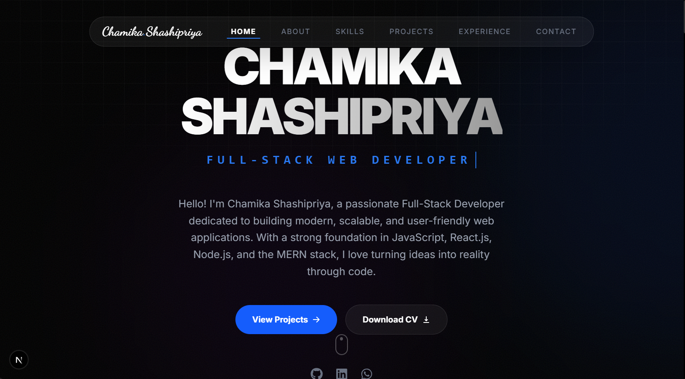

# Modern Portfolio | Next.js + Tailwind CSS + Framer Motion + Three.js

A high-performance, visually stunning developer portfolio built with modern web technologies. This project features smooth animations, 3D elements, and a fully responsive design to showcase projects and skills with a premium feel.



## ✨ Key Features

- **🚀 Performance Optimized**: Built with Next.js for fast loading and SEO friendliness.
- **🎨 Premium UI/UX**: Modern dark-themed design with glassmorphism, smooth micro-animations, and vibrant gradients.
- **🧊 3D Elements**: Interactive 3D scene background powered by Three.js and React Three Fiber.
- **🎭 Framer Motion**: Advanced layouts and scroll-triggered animations for an engaging experience.
- **📱 Ultra-Responsive Design**: Specialized support for everything from old mobile phones to 5K iMac displays.
- **📏 Capped Readability**: Smart container system that caps content at 1920px for optimal readability on ultra-wide monitors.
- **📄 CV Download**: Integrated resume download functionality with custom file name support.
- **⚡ Smooth Scrolling**: Integrated with Lenis for a high-end kinetic scrolling feel.
- **📧 Contact Integration**: Built-in contact form with EmailJS integration and validation.

## 🛠️ Tech Stack

### Core
- **Next.js**: Framework for React-based web applications.
- **React**: Library for building user interfaces.
- **TypeScript**: Static typing for enhanced developer experience and code quality.

### Styling & Animation
- **Tailwind CSS**: Utility-first CSS framework for rapid UI development.
- **Framer Motion**: Production-ready motion library for React.
- **Lenis Scroll**: Lightweight smooth scroll library.
- **Lucide & React Icons**: Comprehensive icon sets for clean visuals.

### 3D Graphics
- **Three.js**: JavaScript 3D Library.
- **React Three Fiber**: React renderer for Three.js.
- **React Three Drei**: Helper library for React Three Fiber.

### Feedback & Utilities
- **EmailJS**: Service to send emails directly from client-side code.
- **Clsx & Tailwind-Merge**: Utilities for managing conditional CSS classes.

## 📁 Project Structure

```text
├── app/               # Next.js App Router (pages and layouts)
├── components/        # React components
│   ├── 3d/            # Three.js / Canvas components
│   └── ui/            # UI sections (Hero, About, Projects, etc.)
├── public/            # Static assets (images, icons, etc.)
├── styles/            # Global styling and tailwind config
├── lib/               # Utility functions and shared libraries
└── types/             # TypeScript definitions
```

## 🚀 Getting Started

### Prerequisites
- [Node.js](https://nodejs.org/) (v18 or higher)
- [npm](https://www.npmjs.com/) or [yarn](https://yarnpkg.com/)

### Installation

1. **Clone the repository**
   ```bash
   git clone https://github.com/ChamikaShashipriya99/My-Portfolio-using-Next.js.git
   cd your-portfolio-repo
   ```

2. **Install dependencies**
   ```bash
   npm install
   ```

3. **Set up Environment Variables**
   Create a `.env.local` file in the root directory and add your credentials (e.g., for EmailJS):
   ```env
   NEXT_PUBLIC_EMAILJS_SERVICE_ID=your_service_id
   NEXT_PUBLIC_EMAILJS_TEMPLATE_ID=your_template_id
   NEXT_PUBLIC_EMAILJS_PUBLIC_KEY=your_public_key
   ```

4. **Run the development server**
   ```bash
   npm run dev
   ```
   Open [http://localhost:3000](http://localhost:3000) with your browser to see the result.

## 🚀 Deployment

### Deploy to Vercel

The easiest way to deploy your Next.js app is to use the [Vercel Platform](https://vercel.com/new?utm_medium=default-template&filter=next.js&utm_source=create-next-app&utm_campaign=create-next-app-readme).

1. **Push your code to GitHub.**
2. **Import your repository into Vercel.**
3. **Configure Environment Variables**:
   In the Vercel project settings, add the following Environment Variables:
   - `NEXT_PUBLIC_EMAILJS_SERVICE_ID`
   - `NEXT_PUBLIC_EMAILJS_TEMPLATE_ID`
   - `NEXT_PUBLIC_EMAILJS_PUBLIC_KEY`
4. **Deploy**: Vercel will automatically detect Next.js and build your project.

---

Built with ❤️ by Chamika Shashipriya
